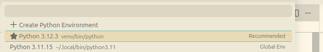
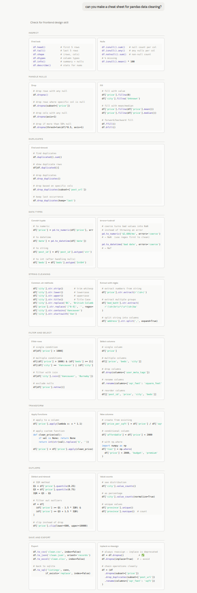
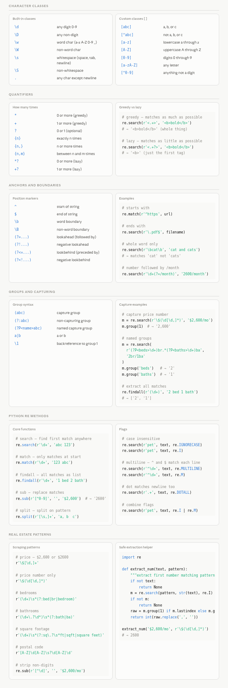

## connecting kernel to jupyter notebook 

problem: python3 -m vev vev creates a virtual env that we need a py-kernel for jupyter to use 
config kernel: python -m ipykernel install --user --name=myvenv --display-name "Python (myvenv)"
select the correct kernel

## cheet sheets

### pandas DataFrames 
This is how to work with DataFrames

### Regex 
This is how to work with Regex 

